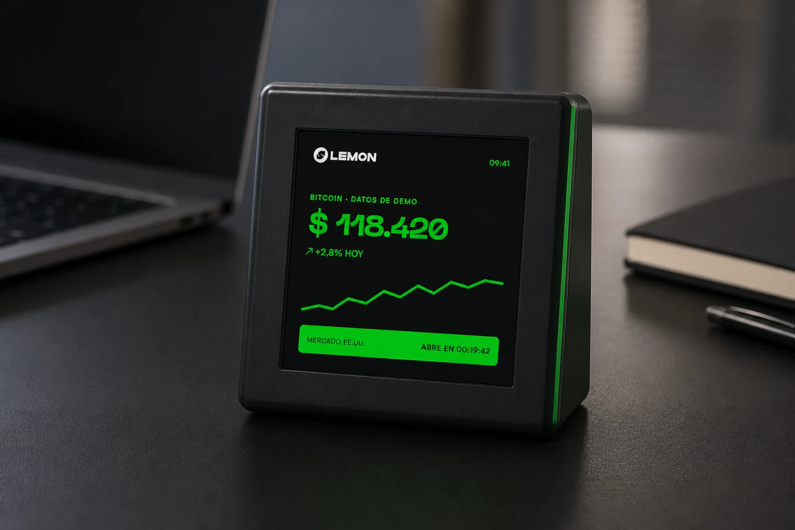
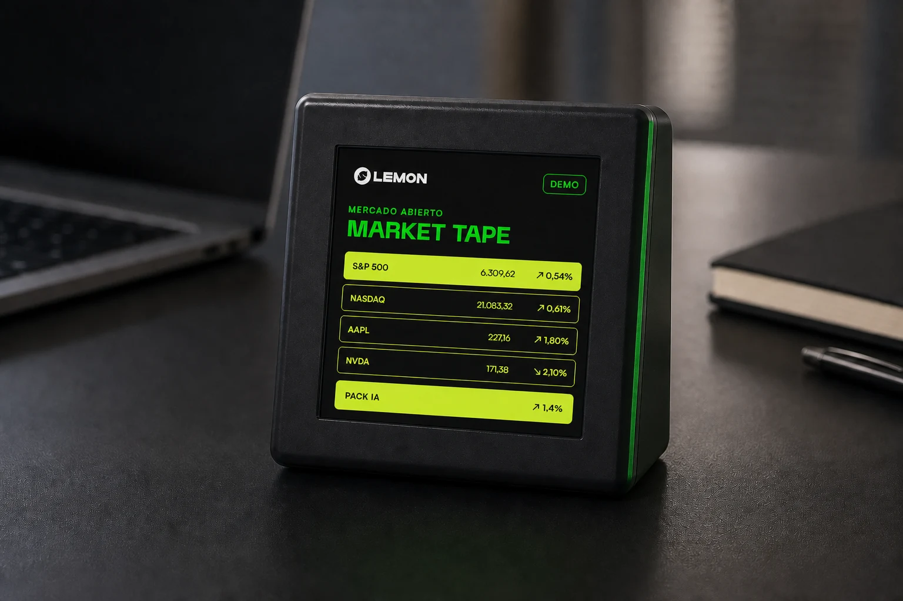
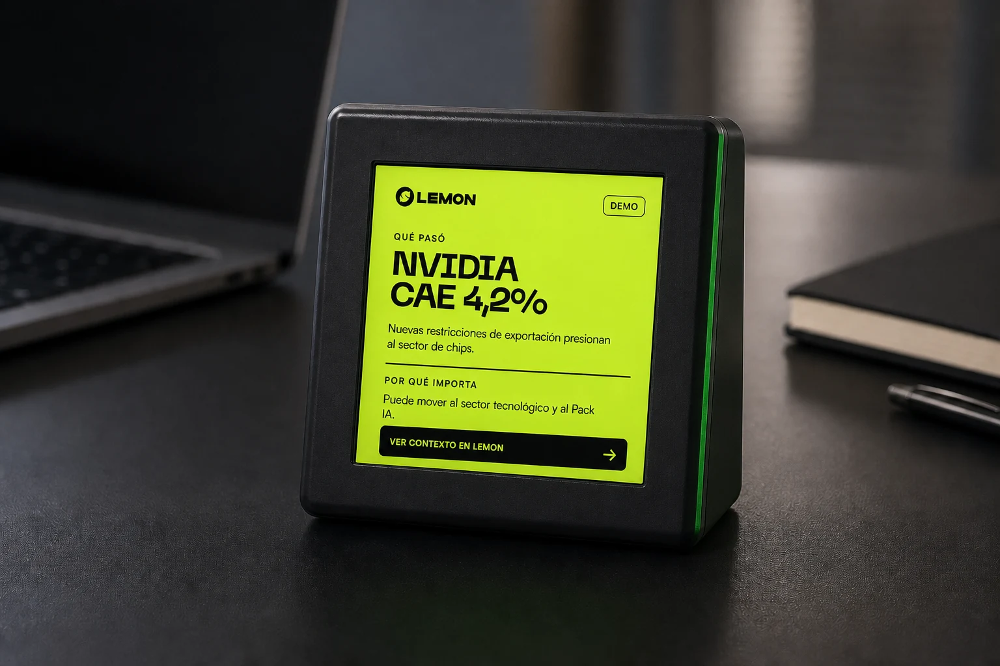

# Lemon Box: evolución de V1 a Lemon Market Desk

Estado: documento fuente para informe y presentación interna.  
Fecha de corte: 22 de julio de 2026.

## Resumen ejecutivo

Lemon Box no empieza en una presentación. Ya existe como objeto físico de escritorio: hay aproximadamente 30 unidades producidas que convierten información del ecosistema Lemon en una presencia visible y permanente.

V1 resolvió un problema concreto: sacar datos útiles —Bitcoin, hora, dólar y mercados— de una pestaña y dejarlos a la vista. La evolución propuesta no descarta ese valor ni pide fabricar otro dispositivo. Usa el mismo hardware como plataforma de software actualizable.

La dirección de V2 es **Lemon Market Desk**: una extensión física viva de Lemon que permanece calma la mayor parte del día, cobra protagonismo cuando ocurre algo relevante y deriva a Lemon cuando vale la pena profundizar.

> De mostrar datos todo el tiempo a decidir qué merece la pantalla en cada momento.

## 1. Origen: el problema que resolvió V1

V1 convirtió una pantalla cuadrada de 4 pulgadas en un objeto reconocible para el escritorio. Su valor no depende de que la persona abra una app o recuerde consultar un precio: la información está presente y se entiende de reojo.

La base de producto que ya existe incluye:

- hardware ESP32-S3 con pantalla táctil IPS de 480 × 480;
- carcasa física y modelos 3D propios;
- home con Bitcoin y Dólar Digital;
- reloj, vistas de acciones, pares y otras experiencias de mercado;
- configuración local, firmware actualizable y herramientas de recuperación;
- una identidad física asociada exclusivamente a Lemon.

V1 demostró que la caja puede ser útil sin convertirse en un terminal financiero ni en una pantalla inteligente genérica.

## 2. Hardware producido y valor actual

El activo principal no es un render: es una flota aproximada de 30 Lemon Boxes ya fabricadas. Cada unidad contiene una pantalla 480 × 480, touch, conectividad Wi-Fi y un ESP32-S3 capaz de recibir nuevas versiones de software.

Ese hardware conserva tres formas de valor:

1. **Presencia:** Lemon ocupa un lugar físico estable en el escritorio.
2. **Atención pasiva:** hora, Bitcoin y estado general se comprenden sin abrir una app.
3. **Capacidad de evolución:** una mejora de firmware puede cambiar la utilidad de las unidades existentes sin reemplazar el objeto.

La V2 debe comenzar por esas unidades y por una estrategia canary. No se propone fabricar una nueva línea antes de probar que el software aumenta el uso y la utilidad del hardware actual.

## 3. Aprendizajes del uso en escritorio

Los documentos de dirección del proyecto sintetizan cuatro aprendizajes:

- la caja funciona mejor como objeto ambiental que como interfaz que exige atención;
- una pantalla pequeña debe contar una cosa principal por vez;
- el usuario necesita entender el estado en aproximadamente dos segundos;
- el touch aporta valor cuando abre contexto, no cuando oculta funciones básicas detrás de gestos.

Por eso la dirección final adopta un principio de atención 90/10: 90% pasivo y visible de reojo; 10% táctil y exploratorio.

## 4. Evolución conceptual: de V1 a V2

| V1: objeto informativo | V2: Lemon Market Desk |
|---|---|
| Muestra datos y vistas disponibles. | Prioriza qué merece ocupar la pantalla. |
| La información compite en una interfaz estable. | Un home calmo cede el foco sólo ante un momento relevante. |
| El usuario navega funciones. | El objeto ofrece contexto y después vuelve al estado ambiental. |
| La caja es un display de mercado. | La caja conecta mercado, producto y contenido editorial de Lemon. |

V2 no es una secuencia de slides como producto final. La demo determinística actual sirve para probar el lenguaje visual y el recorrido; el producto debe vivir en un home persistente y responder gradualmente al ritmo real del día.

## 5. Arquitectura de la experiencia final

### Ambiente

Estado normal, comprensible de reojo: hora, activo principal, precio, variación y una señal secundaria. Bitcoin puede ser el héroe inicial; la experiencia vuelve aquí después de cada interrupción.

### Momentos

Intervenciones breves y justificadas: apertura o cierre, un movimiento excepcional, un hito de Bitcoin, una noticia relevante o el pulso de un Pack. Market Tape es un lenguaje para esos momentos, no una animación permanente.

### Contexto y continuidad

Un toque explica qué pasó y por qué importa, con fuente y hora cuando los datos sean reales. Un QR o deep link aparece sólo cuando existe un destino útil dentro de Lemon. La caja informa y deriva; no ejecuta operaciones ni emite recomendaciones.

### Operación gradual

La experiencia futura requiere una capa pequeña de control: perfiles, configuración acotada, tarjetas editoriales con vencimiento, estado de dispositivos y rollout canary. No requiere un mega-dashboard.

## 6. Estado actual probado

### Probado en código y build

- Existe un entorno separado `matouch_esp32s3_40_v2_demo`; el modo V2 queda apagado en la build normal.
- El reproductor usa una timeline local de nueve escenas y 78 segundos.
- La demo evita Wi-Fi y APIs; usa fixtures congelados marcados como datos de demo.
- Renderiza home, preapertura, apertura, Market Tape, Pack IA, noticia, contexto, QR y retorno.
- El touch permite avanzar de noticia a contexto y QR.
- La UI usa assets oficiales, tokens RGB565 auditados y una superficie de 480 × 480.
- Las builds normal y demo quedaron documentadas con tamaño y hash en el checklist de canary; esos hashes corresponden únicamente a esa fotografía de fuentes.
- Existe además un tercer entorno aislado, `matouch_esp32s3_40_v2_real`, que compila como candidato de canary con home persistente, BTC live y pares vía Binance/CriptoYa/CoinGecko, watchlist/Market Tape vía Yahoo Finance, navegación táctil y Settings.
- El runtime real modela explícitamente `live`, `cached`, `stale`, `offline`, `error` y `rate limited`; no presenta un valor restaurado como cotización actual.
- La UI real usa inset de 32 px, no contiene fixtures de la demo y mantiene Noticias como `Provider pendiente`; Packs todavía no están implementados porque no existe una fuente contractual confirmada.

### Validado hoy en hardware

El 22 de julio de 2026 se flasheó una unidad canary real con el firmware demo V2 y se confirmó visualmente el recorrido en la pantalla física. Esta confirmación operativa fue provista para este informe.

Esta validación confirma que el lenguaje V2 puede correr sobre una Lemon Box existente. No prueba datos en vivo, operación remota, publicación editorial ni rollout de flota. El runtime V2 real fue implementado y compilado en paralelo, pero su checklist mantiene correctamente la prueba física como pendiente.

## 7. Evidencia visual

Las siguientes imágenes representan **dirección visual de producto**. No son fotografías de datos productivos ni evidencia de una integración en vivo.

### Home ambiental

### Market Tape

### Noticia y contexto

Los tres visuales editoriales toman como referencia la geometría del modelo 3D real y los mockups reproducibles de 480 × 480. Siguen siendo dirección visual: no son fotografías de una integración productiva. Los conceptos originales permanecen disponibles en [`docs/v2/concepts`](./concepts/).

Artefactos relacionados:

- [Dirección de producto](./2026-07-22-product-direction.md)
- [Especificación de experiencias](./2026-07-22-experience-spec.md)
- [Cumplimiento de marca](./2026-07-22-brand-compliance.md)
- [Control, contenido y flota](./2026-07-22-control-plane.md)
- [Storyboard de demo](./2026-07-22-demo-storyboard.md)
- [Checklist de canary](./2026-07-22-physical-canary-checklist.md)
- [Arquitectura del runtime V2 real](./2026-07-22-real-runtime-architecture.md)
- [Plan de implementación del demo](../plans/2026-07-22-lemon-v2-demo-player.md)
- [Plan del canary V2 real](../plans/2026-07-22-lemon-box-v2-real-canary.md)
- [Mockups reproducibles 480 × 480](./mockups/README.md)
- [Assets oficiales y hashes](./assets/brand-official/SOURCES.md)

## 8. Límite entre probado, prototipo y propuesto

| Estado | Qué incluye | Qué no debe afirmarse |
|---|---|---|
| **Probado** | Hardware existente; tres builds separadas —normal, demo y V2 real—; secuencia demo offline de 78 segundos; validación visual del demo en una unidad canary; contratos automatizados del runtime real. | Que el runtime real ya fue validado físicamente o que la flota está actualizada. |
| **Prototipo** | Candidato V2 real compilado: home persistente, BTC/watchlist reales, Tape, contexto, Settings, cache/freshness e inset de 32 px. | Que Noticias, Packs, deep links editoriales u operación remota están conectados. |
| **Propuesto** | Momentos automáticos; Packs oficiales; tarjetas editoriales; deep links; configuración remota; telemetría mínima; rollout gradual. | Que existe hoy un control plane productivo, publicación editorial o atribución de scans. |

## 9. Roadmap realista

### Fase 0 — Validar físicamente el canary real

- identificar puerto y serial, guardar la app actual y verificar el rollback antes de escribir;
- flashear únicamente la app del entorno V2 real con `keep/keep` y autorización explícita;
- verificar home, BTC/watchlist, Tape, contexto, Settings, timeouts y estados offline/cache;
- registrar ID de unidad, hash, hora, brillo, touch y video.

### Fase 1 — Operar una experiencia persistente

- observar una unidad durante una jornada real;
- verificar freshness, retry, cache y fallback seguro;
- ajustar legibilidad, brillo, temperatura y permanencia;
- definir reloj de mercado y reglas de interrupción sobre la base ya implementada;

### Fase 2 — Piloto de 5 a 10 unidades

- acordar fuentes oficiales para acciones, índices y Packs;
- definir workflow editorial y aprobación Legal/Brand;
- publicar tarjetas versionadas, con vencimiento y retiro;
- habilitar perfiles simples, estado online, versión y canary/rollback;
- medir uptime, interacciones y continuaciones sin recolectar datos innecesarios.

### Fase 3 — Evolución de las unidades existentes

- desplegar por anillos, empezando siempre por un canary conocido;
- observar cada anillo antes de ampliar;
- decidir si la utilidad probada justifica llegar a las ~30 unidades;
- sólo después evaluar nuevas terminaciones físicas o más hardware.

## 10. Decisiones y límites

- Lemon Box V2 es exclusivamente para Lemon; no forma parte de un store general de Ferced.
- La caja no compra, vende ni recomienda activos.
- El ESP32 no resume noticias ni ejecuta IA generativa.
- Los nombres, composición y rendimiento de Packs deben venir de una fuente oficial.
- El QR no debe ser permanente ni usar un destino inventado.
- Brand y Legal deben aprobar noticias, disclaimers, usos de color y rollout público.
- Ninguna validación de una unidad autoriza OTA o actualización masiva.

## Frase de cierre

Lemon Box V1 puso a Lemon en el escritorio. Lemon Market Desk propone que ese objeto ya existente entienda cuándo quedarse quieto, cuándo explicar el mercado y cuándo continuar la experiencia dentro de Lemon.
